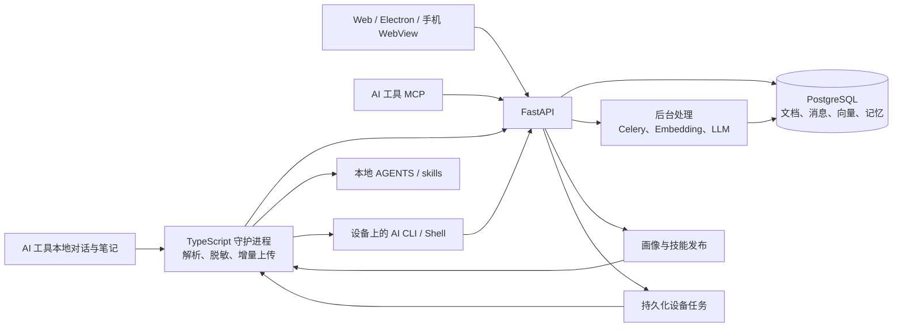

# Memento 项目分析

分析日期：2026-10-04（北京时间）。代码基线：`77aead2371f6e4d67767b1bad92a294a288c0a3f`，其应用代码提交为 `a36e8ea4df83`。

**结论：Memento 已有完整的个人 AI 记忆产品骨架，最有价值的是跨工具采集、可追溯记忆、MCP 召回及画像/技能回写形成的闭环。当前主要瓶颈是数据完整性、用户隔离和迁移后的交付一致性；应优先完成一轮稳定性与安全收口，再扩大自主执行与新界面功能。**

本次检查覆盖后端、Web、守护进程、MCP、桌面/手机壳、数据库模型、CI 和发布配置。采用源码交叉核对、官方文档查证、已有 CI 日志及公开更新接口只读检查。没有启动本地服务、重跑数据、修改业务代码、发版或操作集群。除明确标注的线上更新接口问题外，缺陷依据为当前源码，不代表已在生产触发。未检查全部端点，也不是完整渗透测试。

**1) 产品定位与实际架构**

项目已有四层业务：保存各个 AI 工具的对话；用全文/向量/图谱检索历史；把纠正、经验整理成长期记忆与技能；将任务派给设备上的 AI 工具执行。由此看，产品定位可聚焦为“跨工具、跨设备的个人 AI 记忆与工作延续系统”。检索质量、记忆可信度和任务可恢复性，是这一路线的核心指标。

| 层次 | 当前实现 | 职责与判断 |
|---|---|---|
| 本机守护进程 | TypeScript，`packages/daemon` | 工具发现、文件监听、增量上传、脱敏、任务执行、画像/技能注入；桌面与命令行共用 |
| 服务端 | Python、FastAPI、异步 SQLAlchemy | 鉴权、文档与记忆管理、混合检索、问答编排、设备任务 |
| 数据层 | PostgreSQL/pgvector、Redis、MinIO | 结构化数据与向量、缓存与任务队列、对象存储 |
| 后台计算 | Celery worker/beat、独立 embedding 服务 | 向量、图谱、日报、复盘、纠正学习、记忆生命周期与检索评测 |
| Web | Next.js 16、React 19、Tailwind、Three.js | 主业务界面；同时供桌面端和手机 WebView 使用 |
| 桌面端 | Electron，`apps/desktop` | 远程 Web 界面、utilityProcess 守护进程、托盘、通知、自动更新 |
| 手机端 | Expo/React Native，`apps/mobile` | 原生登录、SecureStore、通知与 WebView 容器 |
| AI 接入 | TypeScript MCP；保留 Python 远程 MCP | 将搜索、核心记忆、技能、待办等提供给 AI 工具 |
| 服务端交付 | GitHub Actions → GHCR → 镜像 SHA 回写 → Fleet/k3s | 声明式更新；当前清单中 API/Web/worker/beat 各一副本 |

这是代码中的设计链路；下面的问题说明其中若干环节还没有可靠闭合。尤其不能沿用 README 的旧 Python watchdog/SQLite 队列描述来判断当前 TypeScript 采集器的可靠性。

规模统计：306 个受 Git 跟踪的源码文件，约 79,318 行；统计包含测试，排除 dist 与生成的 `api.gen.ts`，不包含依赖目录。模型定义有 33 张表，API 文件有 200 个路由装饰器，Web 有 33 个 `page.tsx`。这是实现规模，不是覆盖率或性能指标。后端目录约 3.34 万行，Web 约 3.04 万行，已需要稳定的模块边界。

**2) 值得保留的设计**

- 原始文档、结构化消息、向量分块、实体/关系/观察、核心记忆分别保存，具备追溯来源的基础。详见 [数据库模型](/Users/haixingdong/dev/memento/server/server/db/models.py)。
- 中文分词全文检索与向量检索通过 RRF 合并，向量不可用时可以降级；这是对实际可用性的考虑。详见 [搜索接口](/Users/haixingdong/dev/memento/server/server/api/search.py:90)。
- 已有固定版本评测题集、Hit@1/5/10、MRR 与回归提醒。评测复用问答检索路径，适合持续衡量召回改进；目前未读取真实评测结果，不能断言召回准确率。详见 [eval_service.py](/Users/haixingdong/dev/memento/server/server/services/eval_service.py:165)。
- 采集后处理有独立连接池、并发限制，embedding/knowledge 有失败补偿；Celery 已处理任务确认和异步连接池生命周期。详见 [连接池](/Users/haixingdong/dev/memento/server/server/db/session.py:32)、[Celery 配置](/Users/haixingdong/dev/memento/server/server/tasks/celery_app.py)。
- 设备任务落库、提问流有续接设计；守护进程与桌面共用，Web 与两种客户端共用界面，降低功能重复开发成本。
- 模型供应商已有统一入口和个人设置支持。应继续把用户配置传到所有后台调用，避免部分工作流回落到全局配置。

**3) 优先修复的问题**

以下 P1 表示应优先修复的安全、数据或主要功能缺陷；P2 表示应安排修复的功能/工程问题。排序考虑影响范围与前置依赖，不代表生产事故次数。

**1) P1：文档与同步状态的身份键不一致，存在跨设备、跨用户覆盖。**

模型唯一键是 `machine_id + tool_id + relative_path`，但 [查找已有文档](/Users/haixingdong/dev/memento/server/server/services/ingest_service.py:705) 仅使用工具和相对路径；[后续更新](/Users/haixingdong/dev/memento/server/server/services/ingest_service.py:853) 会覆盖或追加内容，通常保留原机器归属。[快速去重](/Users/haixingdong/dev/memento/server/server/services/ingest_service.py:493) 同样缺少机器条件，[更新同步状态](/Users/haixingdong/dev/memento/server/server/services/ingest_service.py:1273) 虽接收 machine_id，却未使用。

触发条件是两个设备或用户同步同一工具、相同相对路径。后果可能是误去重、内容串写；已有多条匹配记录时还可能触发多行查询异常。应统一身份键和授权范围；历史冲突数据必须先备份、审计，再做有版本记录的修复。验收应包含两个用户同工具同路径、同用户两台设备、重复分片和并发上传。

**2) P1：设备心跳与任务领取存在用户边界缺口。**

[ensure_device](/Users/haixingdong/dev/memento/server/server/services/device_service.py:23) 按客户端提供的设备标识全局查找，命中后不检查当前用户归属；[心跳](/Users/haixingdong/dev/memento/server/server/api/ingest.py:305) 在启用远程执行时返回该设备的执行密钥。前提是持有任一有效采集令牌、知道目标设备标识且启用远程执行。这里确认的是越权路径，未验证是否被利用。

另一个独立缺口是 [任务领取](/Users/haixingdong/dev/memento/server/server/api/tasks.py:347) 按设备名及前缀全局扩展候选机器，没有用户范围；同名设备可能领走其他用户的任务，随后还会改绑任务机器。该接口对采集令牌也只判断非空。修复应以经过授权的设备主键为边界，别名采用明确的同用户合并关系，并让任务领取具备原子性。对象标识不能替代授权检查，参见 [OWASP 对象级授权指引](https://cheatsheetseries.owasp.org/cheatsheets/Insecure_Direct_Object_Reference_Prevention_Cheat_Sheet.html)。

**3) P1：通知内容跨入 Shell 与 HTML 执行边界。**

[桌面通知](/Users/haixingdong/dev/memento/apps/desktop/src/main.ts:219) 将标题/正文拼入 `child_process.exec()`，仅移除双引号与反斜杠。macOS 的外层单引号、Linux 的命令替换仍可能受输入影响。数据来自服务端通知 feed 和 [通知 IPC](/Users/haixingdong/dev/memento/apps/desktop/src/main.ts:792)。在通知正文可控时，存在以桌面用户权限执行命令的风险。

Web [通知 toast](/Users/haixingdong/dev/memento/web/src/lib/native-notify.ts:98) 又将同类文本直接放进 `innerHTML`，有 HTML/脚本注入入口。应优先用 Electron 原生通知；确需系统命令时使用无 shell 的参数数组，并校验 IPC 来源；Web 用文本节点渲染。依据：[Node 子进程文档](https://nodejs.org/api/child_process.html#child_processexeccommand-options-callback)、[Electron 安全指南](https://www.electronjs.org/docs/latest/tutorial/security)。本轮未执行攻击载荷。

**4) P1：上传失败三次后推进游标，产生持久化漏采。**

[watcher](/Users/haixingdong/dev/memento/packages/daemon/src/watcher.ts:410) 对同一分片累计失败三次，直接跳过并保存 offset；[上传器](/Users/haixingdong/dev/memento/packages/daemon/src/ingest.ts:104) 将网络异常、401、500 等一并折叠成 false。恢复联网后，被推进游标跨过的字节不会自动补发。这是服务端缺失数据，不能误称本地源文件被删除。

应只在服务端确认成功后推进游标；区分可重试故障和明确无效输入，为坏数据保留可审计隔离记录，采用持久化待上传状态。验收标准是断网、重启、令牌失效、服务端 5xx 后，原始消息最终不丢不重。

**5) P1：凭据保护存在两个具体缺口。**

已跟踪的 [docker-compose.yml](/Users/haixingdong/dev/memento/docker-compose.yml:146) 及第 195 行包含非空的上游 API key 默认值；未尝试验证其有效性，也未在报告中复述。应核查对应凭据、撤销或轮换，再移除默认值并通过部署 Secret 注入。仅删除当前行不能处理历史暴露，参见 [GitHub 敏感信息处理说明](https://docs.github.com/en/authentication/keeping-your-account-and-data-secure/removing-sensitive-data-from-a-repository)。

本机上传 [ingest.ts](/Users/haixingdong/dev/memento/packages/daemon/src/ingest.ts:87) 只调用文本正则脱敏，已实现的 [sanitizeJson](/Users/haixingdong/dev/memento/packages/daemon/src/sanitizer.ts:83) 未接入生产上传。通用正则无法跨过 JSON 字段名尾部引号，因此普通 password/token 字段可能离开设备；已被专用密钥格式规则命中的值除外。应先按内容类型识别 JSON/JSONL，再做结构化脱敏，并测试真正的上传入口。

**6) P1：自主任务与晚间复盘存在确定的接口和状态错误。**

[mission_service.py](/Users/haixingdong/dev/memento/server/server/services/mission_service.py:196) 读取 `risk.level`、后续读取 `risk.reasons`，但 [RiskFinding](/Users/haixingdong/dev/memento/server/server/services/risk_policy.py:15) 只有 label/detail，分类函数还可能返回 None。因此当前 `exec_shell` 分支会在派发前抛异常，不能视为自主执行已经打通。

[AgentMission](/Users/haixingdong/dev/memento/server/server/db/models.py:876) 的 steps/context 是普通 JSONB，而 [任务推进](/Users/haixingdong/dev/memento/server/server/services/mission_service.py:282) 原地修改列表/字典，未使用 Mutable 或显式标脏。SQLAlchemy 不会自动持久化这种修改；步骤历史和 active_device_task_id 会出现保存缺口。修好前述接口后，这可能继续导致重复决策/派发。依据：[SQLAlchemy JSONB 变更跟踪](https://docs.sqlalchemy.org/en/20/dialects/postgresql.html#sqlalchemy.dialects.postgresql.JSONB)。

另外，[晚间复盘](/Users/haixingdong/dev/memento/server/server/services/pulse_service.py:239) 传入 `target_date`，但 [run_dreaming_pipeline](/Users/haixingdong/dev/memento/server/server/services/dreaming_service.py:947) 接受的是 days_back/start_date/end_date/tag，会产生 TypeError；调用方捕获后，外层仍写当日已发送标记。这仅指 pulse 晚间入口，不能扩大为 Celery 夜间 dreaming 整体失效。

应统一风险类型、用可持久化状态转换、给等待动作保存下次执行时间、明确失败与重试；增加真实数据库状态重读的任务生命周期测试。当前 mission 模型调用还未传 user，应一并核对个人模型设置是否生效。

**7) P2：手机端把真实失败包装成成功。**

[移动端桥接代码](/Users/haixingdong/dev/memento/apps/mobile/src/app/index.tsx:63) 拦截晨报与晚间复盘请求，在完成前发出成功语义通知；网络错误或非成功响应被转换成人工 HTTP 200。用户无法据此判断工作是否完成。应区分“已接收”“执行中”“已完成”“失败”，保留真实后端状态；成功通知以任务结果为依据。

**8) P1，线上只读确认：旧客户端更新接口的校验值与发布包不一致。**

本次对 [Windows 更新接口](https://mem.ihasy.com/api/system/update/check?platform=windows&version=1.0.63)、[macOS 更新接口](https://mem.ihasy.com/api/system/update/check?platform=macos&version=1.0.63)、[Linux 更新接口](https://mem.ihasy.com/api/system/update/check?platform=linux&version=1.0.63) 的响应与 [v1.0.64 Release](https://github.com/ddong8/memento/releases/tag/v1.0.64) 元数据进行比较：三者均提示 1.0.64，size 与 Release 一致，但 SHA-256 仍为旧值。

| 平台 | 仓库元数据 size（字节） | Release size（字节） | 线上 SHA-256 与 Release digest |
|---|---:|---:|---|
| Windows | 34,826,918 | 35,132,056 | 不一致 |
| macOS | 38,730,336 | 39,890,317 | 不一致 |
| Linux | 11,849,865 | 12,156,958 | 不一致 |

[updates.py](/Users/haixingdong/dev/memento/server/server/api/updates.py:285) 先读取本地 sha，随后仅用 GitHub 更新 size；[发布脚本](/Users/haixingdong/dev/memento/.github/workflows/desktop-release.yml:500) 写元数据时也没有计算 sha256。影响遵循这个接口并校验 SHA 的旧客户端；Electron 使用独立 electron-updater 流程，不应笼统认定全部客户端无法更新。应从同一份最终构建产物生成文件名、精确大小、SHA，并在发布后逐平台自动比较。保留旧客户端要求的 ZIP 协议。

**9) P1：下一次客户端发布依赖已经删除的 Flutter 源码。**

当前仓库没有受跟踪的根目录 `mobile/` 文件，但 [Flutter 构建 job](/Users/haixingdong/dev/memento/.github/workflows/desktop-release.yml:35) 仍以该目录执行；[publish-release](/Users/haixingdong/dev/memento/.github/workflows/desktop-release.yml:439) 依赖三个 Flutter job，Electron/Android 发布又依赖它。因此在当前源码上触发同一流程，旧构建失败将阻断后续发布，符合 [GitHub needs 规则](https://docs.github.com/en/actions/reference/workflows-and-actions/workflow-syntax#jobsjob_idneeds)。

[最近客户端发布成功记录](https://github.com/ddong8/memento/actions/runs/36547614864) 是 9 月 29 日，早于旧源码删除，不能作为当前发版流程可用的证据。应解开已下线构建依赖，分别定义 Electron、Android 和旧客户端迁移包的产物与支持期限。

**10) P2：Compose 自部署构建上下文与 Dockerfile 不匹配。**

[Compose](/Users/haixingdong/dev/memento/docker-compose.yml:223) 使用 `./web` 为 context，但 [Dockerfile](/Users/haixingdong/dev/memento/web/Dockerfile:5) 需要仓库根下的 workspace 文件和 packages/core。新构建无法从该 context 找到所需路径。应与已有 CI 保持一致：仓库根 context、web/Dockerfile。依据：[Docker 构建上下文规则](https://docs.docker.com/build/concepts/context/)。本次未在本机构建复现。

**11) P2：自动图谱抽取忽略长对话后续内容。**

[graph_service.py](/Users/haixingdong/dev/memento/server/server/services/graph_service.py:122) 只对开头 4000 字做版本哈希，有旧观察且前缀未变即跳过；抽取输入也从最早消息截取前 4000 字。已抽取的长对话即使追加重要结论，也不会进入此自动图谱链路。其他全文/向量/dreaming 流程不在这个结论范围内。

应按新增消息区间增量提取，以源消息范围、内容版本、抽取器版本记录进度；纠正旧结论时保留取代关系。验收应把关键结论放在长对话末尾，确认能检索到并回溯原始消息。

**4) 测试与交付的实际状态**

[当前应用提交的 CI](https://github.com/ddong8/memento/actions/runs/37206056474) 成功；日志结果为后端 203 passed / 1 skipped，TypeScript core 9 passed、daemon 44 passed、MCP 6 passed，合计 262 passed / 1 skipped。这是已有 CI 的结果，本次没有重新执行这些测试。

仓库有后端测试文件 23 个、TypeScript 测试文件 11 个。Python MCP 的两个版本测试 job 实际跳过测试；Web、Electron、Expo 没有跟踪的测试文件，主要依靠类型检查与构建。未找到覆盖率门槛或浏览器端到端测试配置，不能由“CI 绿”推导核心跨模块路径已经验收。

[镜像构建及 GitOps 回写](https://github.com/ddong8/memento/actions/runs/37206056468) 成功；本次未读取集群 pod 状态，因此没有确认所有运行实例均为当前版本。当前最缺的是少量高价值场景：跨用户同名资源、上传故障恢复、任务状态跨进程重读、通知内容输入边界，以及从安装到升级的完整流程。

**5) 性能、可维护性及尚待验证的边界**

目前没有生产延迟分位数、数据量、数据库查询计划、并发或 LLM 费用数据，因此不能给出 QPS、容量或成本结论。代码中已有缓存、向量索引、并发限制和池隔离；下一步应按链路补采集延迟、待上传积压、索引滞后、召回命中率、首字延迟、任务重复率和每用户模型费用。

维护性方面，[问答页](/Users/haixingdong/dev/memento/web/src/app/ask/page.tsx) 3357 行，[dreaming 服务](/Users/haixingdong/dev/memento/server/server/services/dreaming_service.py) 1901 行，[项目接口](/Users/haixingdong/dev/memento/server/server/api/projects.py) 1838 行。Web 仍有 989 行手写 API client；core 提供的 typed client/AskStream 尚未成为实际统一入口。建议按问答会话、设备执行、检索、记忆生命周期拆分职责，并让共享契约真正承接调用，避免仅把代码搬文件而保留重复逻辑。

以下是需要专项验证的风险，不列为已确认生产故障：

- API 启动同时执行数据库迁移和进程内 pulse：[main.py](/Users/haixingdong/dev/memento/server/server/main.py:399)。扩副本或滚动发布期间可能发生重复调度、迁移竞争；pulse 的读标记再写标记不是原子锁。应使用单次迁移 Job、明确的后台调度所有权和任务幂等键。参见 [FastAPI 部署中的启动前步骤](https://fastapi.tiangolo.com/deployment/concepts/#previous-steps-before-starting)、[Celery 周期任务重叠说明](https://docs.celeryq.dev/en/stable/userguide/periodic-tasks.html)。
- 采集事务提交与异步后处理入队的时序，需要检查旧文档更新时是否会读取旧内容；补偿任务不等同于事务一致性保证。
- GET 缓存键没有用户身份，登出没有同步清理 in-flight 请求；但登录页还有整页刷新，持续影响需验证，不能直接声称全部旧用户数据会长期泄露。
- `/health` 固定返回 ok，只能证明请求处理仍在运行；当前 readiness 不能据此证明数据库、队列或模型服务可用。可按依赖重要性补充 readiness 和业务健康指标，避免把外部模型偶发故障变成反复重启。
- 文档中的表数量、旧采集器、Flutter 支持状态与实际代码有漂移。迁移完成标准应同时覆盖代码、CI、安装脚本、升级协议、用户说明和真机验收。
- 代码中的备份计划为每日，与本次提供的每周偏好不同。此处仅记录差异，未修改计划。

**6) 已记录的实施待办与验收顺序**

| 顺序 | 待办 | 验收标准 |
|---|---|---|
| 1) | 修复文档/设备/任务授权边界，处理明文凭据，消除通知执行边界 | 两租户同名同路径测试通过；凭据状态核实；通知始终作为数据 |
| 2) | 修复上传确认与脱敏，审计可能的历史缺口 | 断网/重启/5xx 后不丢不重；敏感 JSON 不离开设备；数据修复先备份、有版本与审计 |
| 3) | 打通 mission、pulse 与真实状态通知 | 风险分类、审批、派发、结果、失败、重启恢复形成可验收闭环；前端不伪造成功 |
| 4) | 修复客户端发布、旧升级元数据和 Compose 入口 | 当前源码完整构建发布；各平台文件名/size/SHA 一致；旧版本升级流程通过 |
| 5) | 修复图谱增量抽取，落实质量指标 | 长对话末尾新结论可召回；同一版本题集对比；每条记忆保留证据 |
| 6) | 收敛共享接口、后台调度和文档 | 客户端共用契约；多实例不重复执行；安装/迁移/支持状态一致 |

上述均为本次分析形成的待办，未自动执行修复或创建外部工单。后续应优先投入“采集完整 → 隔离正确 → 召回可信 → 任务可恢复”这条主链。界面已有较广覆盖；在缺少实际浏览器和真机验收前，本报告不对视觉效果、响应式体验或 3D 渲染性能给出评分。
