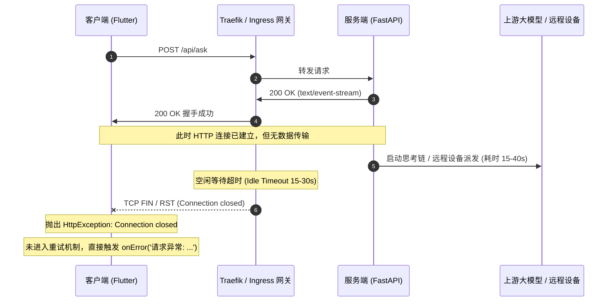

# 提问流式响应“经常会出现请求异常”排查与修复说明 (v1.0.49)

## 1. 问题现象与截图分析
用户在客户端使用 Ask 问答或设备调度功能时，频发红色错误气泡：
```text
请求异常: HttpException: Connection closed while receiving data, uri = http://mem.ihasy.com/api/ask
```
此异常严重影响用户正常对话与提问，往往在提问后等待 15~30 秒左右直接崩溃中断。

---

## 2. 根因深度剖析 (Root Cause Anatomy)

通过追踪客户端 `mobile/lib/core/sse_client.dart` 与服务端 `server/server/api/ask.py` 的全链路交互，精确定位到两大核心成因：



### 根本原因 1：服务端长时间静默无心跳，触发代理与网关空闲断连
1. 在 `server/server/api/ask.py` 中：
   - 当调用大模型（尤其是带思维链的 DeepSeek-R1、Claude Thinking 或推理较慢的开源模型）时，`stream_chat_completion` 在产出第一个 token 之前可能需要 **15 ~ 45 秒** 的思考等待。
   - 当调用设备端 Agent 或复杂命令时，设备建立连接、启动工作区准备往往也需要数十秒。
2. 在此期间，服务端 `stream()`、`agent_stream()` 或 `_direct_agent_stream()` **没有向网络中发送哪怕一个字节**。
3. 中间的 **Traefik Ingress（k3s 集群默认网关）**、家用路由器 NAT 网关、Cloudflare 或操作系统 TCP Socket 的空闲超时时间（通常为 15s~30s）被触发，网关认为连接已闲置，主动断开 TCP 连接（`Connection reset by peer` 或 `Connection closed while receiving data`）。

### 根本原因 2：客户端未处理流式阶段断连重试，抛出原生底层异常
1. 客户端原有的重试循环仅包裹了 `dio.post<ResponseBody>(...)` 的 HTTP 握手阶段。
2. 一旦服务端返回 `200 OK`，循环即通过 `break` 退出。
3. 当在 `stringStream` 监听过程中连接断开时：
   - 如果用户尚未收到任何 token（`hasReceivedContent == false`），底层抛出的是 `dart:io` 的 `HttpException`，并非 `DioException`。
   - 异常穿透 `on DioException catch`，直接跌入最外层的通配 `catch (e)`。
   - 代码执行了 `onError('请求异常: $e')`，把底层开发环境级别的 Raw Exception 直接砸在用户界面上，且没有自动重试。

---

## 3. 全链路修复方案

我们通过**“服务端主动保活心跳” + “客户端首包前静默容灾重试” + “用户友好状态降级”**的三层防御体系彻底根治该问题：

### 防御层 1：服务端通用流式保活生成器 (`sse_keepalive_generator`)
在 `server/server/api/ask.py` 中引入非侵入式异步流保活封装：
- 在后台启动任务消费原始事件流，并由 `asyncio.Queue` 缓冲。
- 若主生成器在 **8 秒** 内没有产生任何新 token 或事件，保活层自动向 HTTP 管道中吐出标准 SSE 注释行：
  ```http
  : keepalive\n\n
  ```
- **技术优势**：
  - 8 秒心跳彻底重置 Traefik / Nginx / 移动蜂窝网络的 Idle Timeout 计时器。
  - 标准 SSE 注释行（以 `:` 开头）在传输层保证 TCP 报文流动，同时被客户端的标准解析器透明忽略，不破坏现有的协议数据（`conversation_id`, `sources`, `delta`, `thinking` 等）。
  - 覆盖全部三种流式生成器：`stream()`（普通问答）、`agent_stream()`（Agent 协作调度）、`_direct_agent_stream()`（直连设备端）。
  - 将所有异步会话保存逻辑收敛到 `finally` 块，确保即便用户主动取消，会话状态与执行结果也能被完整持久化。

### 防御层 2：客户端首包到达前静默自动重试
在 `mobile/lib/core/sse_client.dart` 中，将重试作用域扩大至流消费阶段：
- **首包到达前断开**（`!hasReceivedContent`）：
  - 若在等待服务端首个思考块或 token 时发生 `Connection closed` / `SocketException`，客户端判断该请求未对用户产生视觉输出，也未执行破坏性操作。
  - 客户端**静默暂停 1.2 秒后自动重新发起连接**（最多重试 2 次），用户感知不到断连，体验顺畅。
- **已接收内容中断连**（`hasReceivedContent == true`）：
  - 保护已渲染的文本内容，不重复请求避免文字重叠或重复派发任务，在尾部优雅附加：
    ```markdown
    > ⚠️ *[网络连接提前中断，若回答未完成可发送“继续”]*
    ```

### 防御层 3：底层异常友好化转译
彻底消灭 `请求异常: HttpException...` 这类原始堆栈：
- 识别 `Connection closed`、`Software caused connection abort`、`SocketException` 等网络波动，转译为：
  `'服务器连接中断（无响应或网络波动），请点击重试'`。
- 保证用户面对的是清晰明确的操作指引，而非晦涩的报错信息。

---

## 4. 验证结果

### 服务端自动化测试 (Pytest)
新增针对 `sse_keepalive_generator` 的专项测试：
- `test_sse_keepalive_normal_flow`: 正常极速流直接透传。
- `test_sse_keepalive_idle_yields_ping`: 模拟上游慢速等待（如模型深度思考 250ms+），验证精准注入 `: keepalive\n\n` 心跳。
- `test_sse_keepalive_exception_propagation`: 异常透明抛出验证。
- **结果**：`server/tests/test_sse_keepalive.py` 3/3 通过；全量测试 **84/84** 100% 通过。

### 客户端自动化测试 (Flutter Test)
新增 `mobile/test/core/sse_client_test.dart` 真实回环网络专项测试：
- `ignores keepalive SSE comments and receives delta cleanly`: 验证 keepalive 心跳被安全忽略，内容正常接收。
- `transparently retries when connection drops before first chunk`: 模拟服务端在发送内容前强行销毁 Socket，验证客户端透明重试并成功恢复。
- `returns friendly error message when all retries fail without content`: 验证重试全部耗尽后给出优雅提示，不再输出原始 `HttpException`。
- **结果**：全量测试 **64/64** 100% 通过。

---

## 5. 版本发布与交付 (v1.0.49)
1. **版本号升级**：
   - `mobile/pubspec.yaml`: `1.0.49+50`
   - `mobile/lib/core/services/update_service.dart`: `defaultValue: '1.0.49'`
2. **提交与推送**：
   - 提交哈希：`5163400`
   - Git Tag：`v1.0.49` 已推送至 GitHub。
3. **CI/CD 触发**：
   - GitHub Actions `desktop-release.yml` 正在编译 macOS (arm64)、Windows (x64) 及 Linux 客户端更新包。
   - `deploy.yml` 正在构建后端 Docker 镜像并由 Fleet 自动发布到 NAS k3s 集群。
4. **主分支元数据同步**：
   - Commit `e9df7f4`: 更新 `data/updates/version.json` 中的各平台发布资产信息与校验值。
